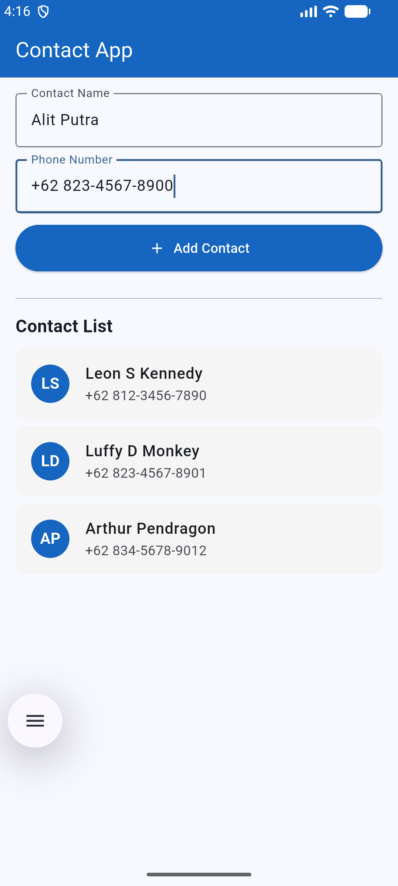

# 📱 Contact App — Flutter

A simple Flutter application for managing contacts. Built as a UI implementation exercise focusing on core Flutter widgets and layout.

---

## ✨ Features

- Add a new contact with a name and phone number
- View all contacts in a scrollable list
- Initials avatar auto-generated from contact name
- Pre-loaded with 3 contacts sample data

---

## 📸 Screenshot



---

## 🧱 Widgets Used

| Widget | Purpose |
|---|---|
| `Scaffold` | Base page structure |
| `AppBar` | Top navigation bar |
| `TextField` | Name and phone number input |
| `ElevatedButton` | Submit / Add Contact |
| `ListView.builder` | Scrollable contact list |
| `Text` | Labels and contact info |
| `Padding` / `SizedBox` / `Container` | Layout and spacing |

---

## 🚀 Getting Started

### Prerequisites

- [Flutter SDK](https://docs.flutter.dev/get-started/install) installed
- VS Code with Dart + Flutter extension
- Android emulator/device

### Run the app

```bash
git clone https://github.com/agusalit/flutter_simple_contacts_ui.git
cd contact_app
flutter pub get
flutter run
```

---

## 📁 Project Structure

```
contact_app/
├── lib/
│   └── main.dart        # All UI and logic
├── pubspec.yaml         # Dependencies
└── README.md
```

---

## 🗂️ Commit History

| Commit Message | Description |
|---|---|
| Initial commit | Initial project setup |
| Add Scaffold and AppBar | Base page structure with top navigation bar |
| Add name and phone TextField inputs | Input fields for contact name and phone number |
| Add Button for adding contact | Button UI to submit new contact |
| Add Contact class | Data model with name and phone fields |
| Add contacts data sample and headerContact List | 3 sample contacts and section label |
| Add ListView to display contacts | Scrollable list with avatar, name, and phone |
| Add functionality to the '+Add Contact' button | Wire up button to add contacts dynamically |
| Add README & Screenshot image | Project documentation |

---

## 👤 Author

**Alit Putra**  
[github.com/agusalit](https://github.com/agusalit)

---

## 📄 License

This project is open source and available under the [MIT License](LICENSE).