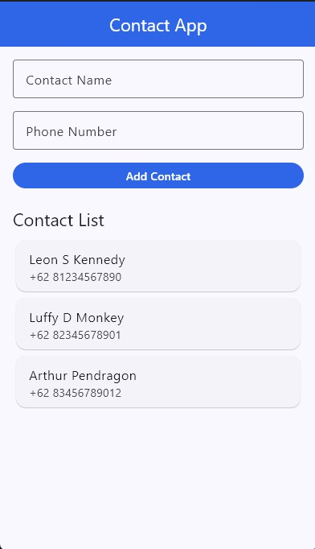

# 📱 Contact App — Flutter

A simple Flutter application for managing contacts. Built as a UI implementation exercise focusing on core Flutter widgets and layout.

---

## ✨ Features

- Add a new contact with a name and phone number
- Input validation for name and phone fields
- View all contacts in a scrollable list
- Empty state message when no contacts exist
- Pre-loaded with 3 sample contacts

---

## 📸 Screenshot



---

## 🧱 Widgets Used

| Widget | Purpose |
|---|---|
| `Scaffold` | Base page structure |
| `AppBar` | Top navigation bar |
| `Form` + `TextFormField` | Input fields with validation |
| `FilledButton` | Submit / Add Contact |
| `Card` + `ListTile` | Contact list items |
| `ListView.builder` | Scrollable contact list |
| `Text` | Labels and contact info |
| `Padding` / `SizedBox` | Layout and spacing |

---

## 🚀 Getting Started

### Prerequisites

- [Flutter SDK](https://docs.flutter.dev/get-started/install) installed
- VS Code with Dart + Flutter extension
- Android emulator/device

### Run the app

```bash
git clone https://github.com/agusalit/flutter_simple_contacts_ui.git
cd flutter_simple_contacts_ui
flutter pub get
flutter run
```

---

## 📁 Project Structure

```
flutter_simple_contacts_ui/
├── lib/
│   └── main.dart        # All UI and logic
├── assets/
│   └── flutter_ss.jpg   # Screenshot
├── pubspec.yaml         # Dependencies
└── README.md
```

---

## 🗂️ Commit History

### **Commit History**

| Commit Message | Description |
| :--- | :--- |
| Defined seed color, primary and onPrimary | Updated color constants for the theme. |
| Polish theme using Material colorScheme tokens | Refined UI using the latest Material Design tokens. |
| Add empty state message when contact list is empty | Displayed a message when the contact list is empty. |
| Add input validation for name and phone fields | Implemented logic to validate name and phone fields. |
| Refactor: update UI components with Material3 styles | Updated components with Material3 styles and improved layout. |
| Refactor: enhance UI with Material3 theme | Applied Material3 theme, custom header, and improved form styling. |
| Refactor: enhance analysis with detailed explanations | Added explanations on state management and UI updates. |
| add analysis and reflection for contact app | Documentation for the contact app design system approach. |
| Refactor: use Material widgets (Card, ListTile) | Implemented Card, ListTile, and InputDecoration components. |
| Add bold labels above TextFields | Positioned bold labels above the TextFields. |
| Replace AppBar with custom container header | Replaced standard AppBar with a centered custom container. |
| Refactor TextField and contact item to helpers | Moved TextField and contact item logic to helper methods. |
| Add README and Screenshot image | Documentation and project visualization. |
| add functionality to the '+Add Contact' button | Linked the button to the contact addition logic. |
| add ListView to display contacts list | Added a ListView to display the contacts list. |
| add contacts data sample and header | Added contact data samples and the list header. |
| add Contact class | Created the core Contact data class. |
| add Button for adding contact | Initialized the button for adding new contacts. |
| add name and phone TextField inputs | Added Name and Phone TextField inputs. |
| add Scaffold and AppBar | Established the basic app structure. |
| Initial commit and project setup | Initial environment configuration. |
| Initial commit | Project repository initialized. |
---

## 👤 Author

**Alit Putra**  
[github.com/agusalit](https://github.com/agusalit)

---

## 📄 License

This project is open source and available under the [MIT License](LICENSE).